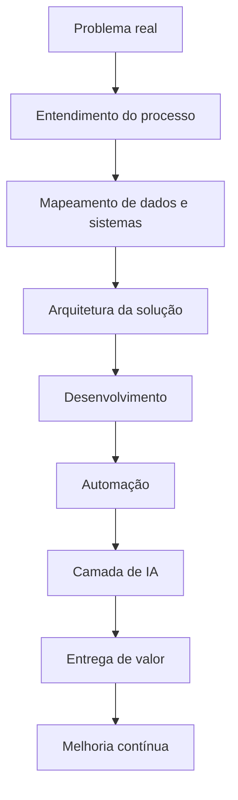

# 👋 Olá, eu sou Silvério Carvalho

<div align="center">

## SBRCode

### Desenvolvedor Full Stack | PL/SQL Developer | IA aplicada à Saúde | Healthtech | Automação Inteligente

🚀 Criando soluções digitais com tecnologia, inteligência artificial, automação e visão estratégica de negócio.

[](https://www.linkedin.com/in/silverio-carvalho/)
[](https://github.com/SBRCode)
[](mailto:silveriobrc@gmail.com)

</div>

---

## 🧠 Sobre mim

Sou **Desenvolvedor Full Stack**, **Desenvolvedor PL/SQL**, **Cientista da Computação**, **Administrador de Empresas** e **Especialista em Processos de Software**.

Atuo na interseção entre **engenharia de software**, **banco de dados**, **automação de processos**, **inteligência artificial** e **soluções aplicadas à saúde**.

Minha trajetória combina conhecimento técnico, visão de negócio e experiência prática em ambientes corporativos, especialmente em contextos que exigem organização, confiabilidade, integração entre sistemas e melhoria contínua.

Atualmente, venho direcionando meus estudos e projetos para o uso avançado de **IA Generativa**, **Agentes de IA**, **automação inteligente** e **healthtech**, buscando criar soluções que ampliem a produtividade, apoiem decisões e transformem processos complexos em fluxos mais inteligentes.

---

## 🚀 Posicionamento

```txt id="9r2ywh"
Tecnologia com propósito.
IA aplicada a problemas reais.
Software orientado a processos.
Automação como estratégia.
Healthtech como campo de inovação.
```

Acredito que tecnologia não deve ser apenas uma ferramenta operacional. Ela deve ser uma camada estratégica capaz de conectar pessoas, processos, dados e inteligência para gerar resultados concretos.

---

## 🎯 Áreas de interesse

* Desenvolvimento Web
* Inteligência Artificial
* Agentes de IA
* Healthtech
* Automação de Processos
* Integrações com APIs
* Engenharia de Software
* Banco de Dados
* PL/SQL
* Governança de TI
* Documentação Técnica
* Engenharia de Prompts
* Soluções corporativas com IA

---

## 🌱 Atualmente estudando

Estou aprofundando meus conhecimentos em **Agentes de IA voltados para Saúde**, com foco em aplicações práticas para ambientes corporativos e assistenciais.

Principais temas em estudo:

* Agentes inteligentes especializados por domínio
* IA aplicada à saúde
* Automação com n8n
* Integração entre IA, APIs e sistemas internos
* Engenharia de prompts
* Orquestração de fluxos inteligentes
* Documentação técnica apoiada por IA
* Uso de IA generativa para produtividade corporativa
* Governança e segurança no uso de IA

---

## 🔭 Atualmente trabalhando

Atuo em ambientes de tecnologia ligados à saúde, com foco em desenvolvimento, sistemas, integrações, processos e inovação.

* **Unimed Rondonópolis**
* **Hospital Dr. Mário Perrone**

---

## 🛠️ Tecnologias e ferramentas

<div align="center">

### Desenvolvimento e banco de dados


### Inteligência artificial, automação e integração


### Áreas estratégicas


</div>

---

## 🤖 IA como diferencial

Vejo a inteligência artificial como uma camada de aceleração para análise, automação, produtividade e inovação.

Meu foco está em explorar IA para:

* Automatizar tarefas repetitivas
* Criar agentes especializados
* Apoiar decisões operacionais e estratégicas
* Melhorar documentação técnica e corporativa
* Interpretar dados e informações complexas
* Integrar sistemas por meio de APIs
* Criar fluxos inteligentes com ferramentas como n8n
* Aumentar produtividade com segurança e governança

---

## 🏥 Healthtech e inovação

Atuar com tecnologia na saúde exige responsabilidade, confiabilidade e clareza.

Por isso, acredito que soluções digitais para saúde precisam considerar:

* Segurança da informação
* Rastreabilidade
* Integração entre sistemas
* Padronização de processos
* Clareza documental
* Disponibilidade
* Governança
* Eficiência operacional
* Apoio real ao trabalho das pessoas

A inovação em saúde não está apenas em criar algo novo. Está em criar algo útil, seguro, aplicável e sustentável.

---

## 🧩 Minha forma de pensar soluções



---

## 📌 O que você encontrará neste GitHub

Este espaço reúne estudos, experimentos, documentações e projetos relacionados a tecnologia, IA e desenvolvimento.

Aqui você poderá encontrar conteúdos sobre:

* Desenvolvimento Full Stack
* PL/SQL
* Banco de dados
* Integrações com APIs
* Automação com n8n
* Agentes de IA
* Engenharia de prompts
* Documentação técnica em Markdown
* Projetos voltados para saúde
* Estudos de IA aplicada a processos corporativos
* Estruturas de software reutilizáveis

---

## 📊 GitHub em números

<div align="center">


</div>

---

## 🧠 Stack mental

```txt id="85pluz"
Software Engineering
Database Thinking
Process Design
AI-First Mindset
Automation Strategy
Healthtech Innovation
Prompt Engineering
Systems Integration
Continuous Improvement
```

---

## 💡 Princípios que guiam meu trabalho

* Resolver problemas reais antes de escolher ferramentas
* Criar soluções simples, úteis e sustentáveis
* Documentar para gerar clareza e continuidade
* Automatizar com responsabilidade
* Usar IA como apoio à inteligência humana
* Integrar tecnologia, processo e negócio
* Evoluir continuamente

---

## 📫 Como me encontrar

* LinkedIn: [linkedin.com/in/silverio-carvalho](https://www.linkedin.com/in/silverio-carvalho/)
* Email principal: [silveriobrc@gmail.com](mailto:silveriobrc@gmail.com)
* Emails alternativos:

  * [silveriobrc@yahoo.com](mailto:silveriobrc@yahoo.com)
  * [silveriobrc@hotmail.com](mailto:silveriobrc@hotmail.com)

---

<div align="center">

## ⭐ Obrigado por visitar meu perfil

Se você se interessa por tecnologia, inteligência artificial, automação, healthtech ou engenharia de software, acompanhe meus projetos.

### From SBRCode

</div>
