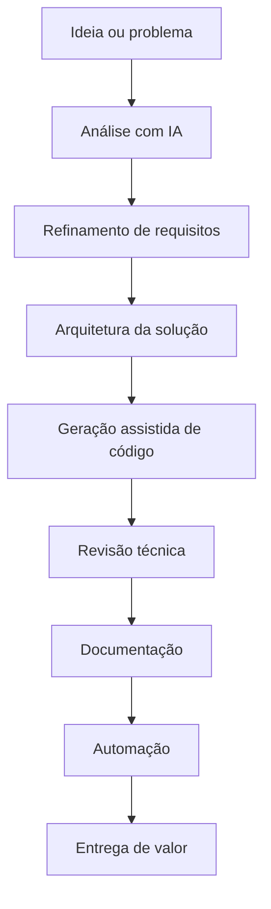
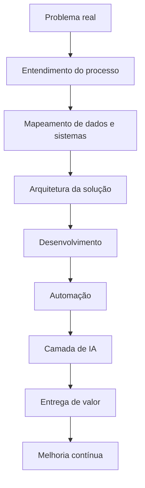

# 👋 Olá, eu sou Silvério Carvalho

<div align="center">

## SBRCode

### Tecnologia há 30 anos | Full Stack Developer | PL/SQL Developer | IA aplicada à Saúde | Healthtech | Automação Inteligente

🚀 Unindo experiência sólida em tecnologia com o uso avançado de Inteligência Artificial para criar soluções modernas, inteligentes e aplicáveis ao mundo real.

[](https://www.linkedin.com/in/silverio-carvalho/)
[](https://github.com/SBRCode)
[](mailto:silveriobrc@gmail.com)

</div>

---

## 🧠 Sobre mim

Sou **Desenvolvedor Full Stack**, **Desenvolvedor PL/SQL**, **Cientista da Computação**, **Administrador de Empresas** e **Especialista em Processos de Software**.

Tenho **30 anos de experiência na área de tecnologia**, acompanhando de perto a evolução dos sistemas corporativos, bancos de dados, desenvolvimento de software, integrações, automações e, mais recentemente, a transformação acelerada promovida pela **Inteligência Artificial Generativa**.

Ao longo dessa trajetória, construí uma visão prática e estratégica sobre tecnologia: não basta apenas desenvolver sistemas, é preciso entender processos, dados, pessoas, negócio e resultado. Essa combinação entre experiência técnica, visão administrativa e conhecimento de processos me permite atuar de forma ampla, conectando tecnologia à realidade operacional das organizações.

Atualmente, meu foco está em aplicar **IA, automação inteligente e engenharia de software** para criar soluções mais eficientes, escaláveis e inovadoras, especialmente no contexto de **healthtech** e ambientes corporativos de saúde.

---

## 🚀 Minha visão

```txt id="7v7hr2"
30 anos de tecnologia.
Experiência prática em sistemas corporativos.
IA aplicada a problemas reais.
Automação como estratégia.
Healthtech como campo de inovação.
Software como ferramenta de transformação.
```

Acredito que a verdadeira inovação acontece quando a experiência acumulada encontra novas tecnologias.

A Inteligência Artificial não substitui a experiência humana; ela amplia a capacidade de analisar, construir, automatizar, decidir e inovar. Meu objetivo é usar IA de forma estratégica para transformar processos complexos em soluções mais inteligentes, produtivas e sustentáveis.

---

## 🤖 Inteligência Artificial como diferencial

Atualmente, utilizo e estudo ferramentas modernas de IA para acelerar desenvolvimento, documentação, automação, análise e criação de soluções inteligentes.

Entre as ferramentas e plataformas que fazem parte do meu ecossistema de estudo e aplicação estão:

<div align="center">


</div>

Meu foco com IA está em:

* Acelerar desenvolvimento de software
* Criar agentes inteligentes especializados
* Automatizar fluxos operacionais
* Melhorar documentação técnica e corporativa
* Apoiar análise de processos e requisitos
* Integrar IA com APIs e sistemas internos
* Criar soluções voltadas para produtividade
* Explorar IA aplicada à saúde com responsabilidade e governança

---

## 🧬 IA aplicada ao desenvolvimento

Utilizo IA não apenas como ferramenta de consulta, mas como uma camada de apoio para engenharia de software.



A combinação entre experiência técnica e IA permite acelerar etapas importantes do desenvolvimento sem perder o critério, a responsabilidade e a visão de negócio.

---

## 🎯 Áreas de interesse

* Desenvolvimento Full Stack
* PL/SQL
* Banco de Dados
* Inteligência Artificial Generativa
* Agentes de IA
* Claude Code
* ChatGPT
* Codex
* Kimi Code
* OpenAI
* Healthtech
* Automação de Processos
* Integrações com APIs
* Engenharia de Software
* Engenharia de Prompts
* Documentação Técnica
* Governança de TI
* Soluções corporativas inteligentes

---

## 🌱 Atualmente estudando

Estou aprofundando meus conhecimentos em **Agentes de IA voltados para Saúde**, com foco em aplicações práticas para ambientes corporativos e assistenciais.

Principais temas em estudo:

* Agentes inteligentes especializados por domínio
* IA aplicada à saúde
* Automação com n8n
* Integração entre IA, APIs e sistemas internos
* Engenharia de prompts
* Orquestração de fluxos inteligentes
* Desenvolvimento assistido por IA
* Documentação técnica apoiada por IA
* Uso de IA generativa para produtividade corporativa
* Segurança, governança e responsabilidade no uso de IA

---

## 🔭 Atualmente trabalhando

Atuo em ambientes de tecnologia ligados à saúde, com foco em desenvolvimento, sistemas, integrações, processos, automação e inovação.

* **Unimed Rondonópolis**
* **Hospital Dr. Mário Perrone**

---

## 🛠️ Tecnologias e ferramentas

<div align="center">

### Desenvolvimento e banco de dados


### Inteligência artificial e desenvolvimento assistido


### Automação, agentes e integração


### Áreas estratégicas


</div>

---

## 🏥 Healthtech e inovação

Atuar com tecnologia na saúde exige muito mais do que conhecimento técnico. Exige responsabilidade, confiabilidade, rastreabilidade, segurança e compreensão dos impactos que sistemas, dados e processos podem gerar na rotina das pessoas.

Por isso, busco desenvolver soluções que respeitem o contexto das instituições de saúde, considerando:

* Segurança da informação
* Rastreabilidade
* Integração entre sistemas
* Padronização de processos
* Clareza documental
* Disponibilidade
* Governança
* Eficiência operacional
* Apoio à tomada de decisão
* Melhoria contínua

A inovação em saúde não está apenas em criar algo novo. Está em criar algo útil, seguro, aplicável e sustentável.

---

## 🧩 Minha forma de pensar soluções



---

## 📌 O que você encontrará neste GitHub

Este espaço reúne estudos, experimentos, documentações e projetos relacionados à tecnologia, IA e desenvolvimento.

Aqui você poderá encontrar conteúdos sobre:

* Desenvolvimento Full Stack
* PL/SQL
* Banco de dados
* Integrações com APIs
* Automação com n8n
* Agentes de IA
* Claude Code
* ChatGPT
* Codex
* Kimi Code
* Engenharia de prompts
* Documentação técnica em Markdown
* Projetos voltados para saúde
* Estudos de IA aplicada a processos corporativos
* Estruturas de software reutilizáveis

---

## 🧠 Stack mental

```txt id="rh0lxb"
30 anos de tecnologia
Software Engineering
Database Thinking
Process Design
AI-First Mindset
Automation Strategy
Healthtech Innovation
Prompt Engineering
Systems Integration
Continuous Improvement
Business Vision
```

---

## 💡 Princípios que guiam meu trabalho

* Resolver problemas reais antes de escolher ferramentas
* Criar soluções simples, úteis e sustentáveis
* Documentar para gerar clareza e continuidade
* Automatizar com responsabilidade
* Usar IA como apoio à inteligência humana
* Integrar tecnologia, processo e negócio
* Aplicar experiência prática com visão de futuro
* Evoluir continuamente

---

## ✨ Minha essência profissional

> Minha trajetória na tecnologia é construída sobre experiência, adaptação e evolução contínua.
> Depois de 30 anos acompanhando mudanças profundas no setor, vejo a Inteligência Artificial como uma das maiores oportunidades para transformar a forma como criamos software, automatizamos processos e entregamos valor para as organizações.

> Para mim, inovação não é apenas usar a ferramenta mais nova.
> É saber conectar experiência, tecnologia, processos e inteligência para resolver problemas reais.

---

## 📫 Como me encontrar

* LinkedIn: [linkedin.com/in/silverio-carvalho](https://www.linkedin.com/in/silverio-carvalho/)
* Email principal: [silveriobrc@gmail.com](mailto:silveriobrc@gmail.com)
* Emails alternativos:

  * [silveriobrc@yahoo.com](mailto:silveriobrc@yahoo.com)
  * [silveriobrc@hotmail.com](mailto:silveriobrc@hotmail.com)

---

<div align="center">

## ⭐ Obrigado por visitar meu perfil

Se você se interessa por tecnologia, inteligência artificial, automação, healthtech ou engenharia de software, acompanhe meus projetos.

### From SBRCode

</div>
